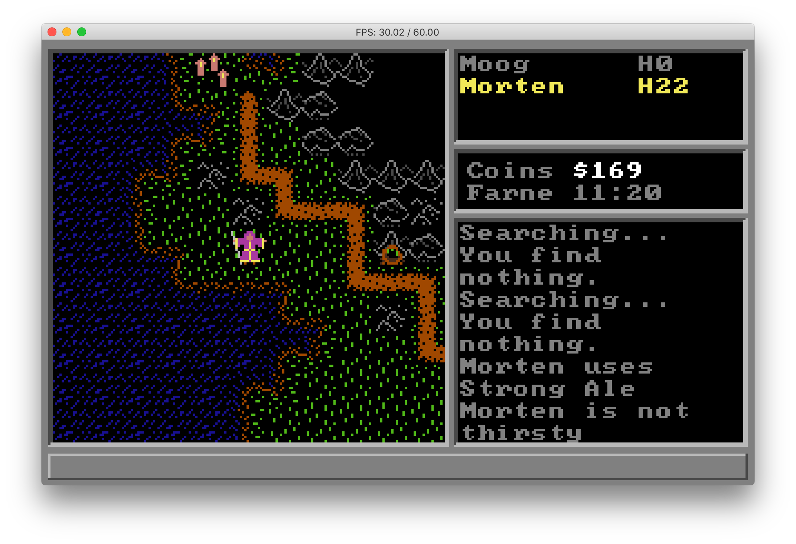

# The Curse of Svaltfen

Download the <a href="https://github.com/uzudil/svaltfen/releases/latest">latest release</a>.  Or install via homebrew for MacOS:
```
brew tap zenmatic/svaltfen https://github.com/zenmatic/homebrew-svaltfen.git
brew install svaltfen
```

Also on itch.io: https://uzudil.itch.io/the-curse-of-svaltfen


Unravel the mysteries of a cursed land in this lost 8-bit rpg epic.
Summoned from blissful oblivion by shadowy manipulators of your
destiny, you set forth across a land in crisis. It seems your
arrival is well timed to conincide with an ominous prophesy: the 
hordes of the underworld have found a new leader and are amassing to 
destroy humanity.



Explore the land of Svaltfen in your search for answers. During your journey you will find other heroes willing to risk their lives to aid your on your quest. Together with your (up to three) companions you will complete an epic adventure and learn the mysteries of a compelling story.


As you journey on your quest, you will observe a full day/night cycle. You can choose to camp at night in the wilderness to rest, eat/drink and replenish your magical reserves.


Learn the history and explore the ruins of an ancient civilization while unraveling the mysteries of the land. By flickering torch-light you will descend into haunted caves and secret passages beneath Svaltfen.


Sometimes you will have to fight and defend yourself against a variety of menacing fauna and mythical beasts, as you explore the darkened depths beneath the land of Svaltfen. During combat you may choose from various melee and ranged weapons, as well as from over 30 magical spells. The action is presented in old-school, turn based combat that values strategy over a fast reaction time.

The <i>Curse of Svaltfen</i> is written in <a href="https://github.com/uzudil/benji4000/wiki/LanguageFeatures">bscript</a> and runs on the <a href="https://github.com/uzudil/benji4000">Benji4000</a> virtual machine.

<span style="color: gray">Gabor Torok (c) MMXX</span>
